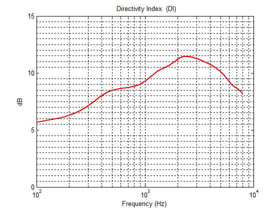
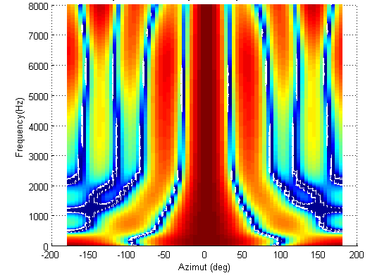
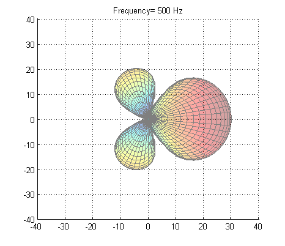
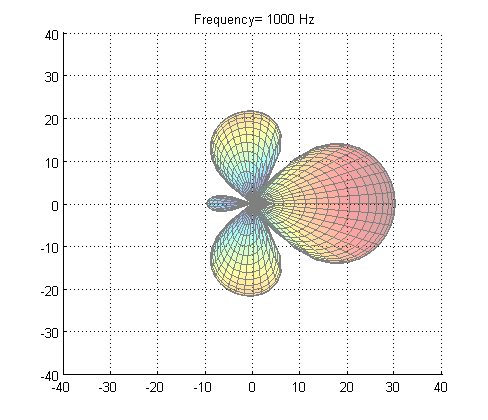
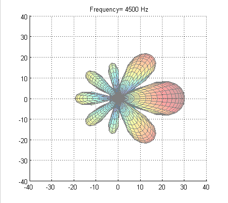

# MIMII Dataset
$$\small{\textbf{Digital Signal Processing and Deep Learning/Machine learning }}$$

$$\large{\textbf{Unsupervised classification: }}$$ 

$$\large{\textbf{Malfunctioning Industrial Machine Investigation and Inspection}}$$ 

$$\small{\textbf{Dr. Stéphane DEDIEU, Spring - Summer 2024 }}$$

## General Introduction

<b>This document is under construction.</b> (Sept 17th, 2024)

  
  
Industrial machinery often experiences failures or breakdowns, leading to considerable costs for businesses. Consequently, there's growing interest in monitoring these machines with various sensors, such as microphones.  
Within the scientific community, the availability of public datasets has enhanced the development of acoustic detection and classification techniques for various scenes and events.   
Hitachi Ltd, has developped the MIMII dataset to the classification sounds of industrial machines operating under both normal and faulty conditions in actual factory settings. With: 
- subsets of machines: pump, valves, slider, fan
- subsets of functioning conditions: normal and abnormal
- background noise

MIMII stands for:  Sound Dataset for Malfunctioning Industrial Machine Investigation and Inspection.  
Many unsupervised classification models based on this dataset are available in the literature or on Github. We will provide links and references. 
 

We develop an automatic unsupervised classification model or automatic diagnosis model for detecting failures or breakdowns of industrial machinery based on their acoustics characteristics, recorded with a 8-microphones circular array.      
Contrarily to most classification models available in the literature, in this study we somewhat violate the rules of the initial challenge: classification of noisy signals. But since we have access to multiple channels, it makes much sense to <b>denoise</b> the signals before starting the classification process. 

Therefore, here the challenge is more about turning the 8-microphones array into a <b> "sensor" for monitoring industrial machinery sounds in a noisy environment.</b> And then apply the classification model to denoised signales for automatically identifying anomalies, failures, breakdowns.    
    
Instead of classifying various machines or types of machines: pump, fan, valve, slider, ...  we will:

- focus on a specific machine type: valve
- denoise the recordings* using MVDR beamforming and a custom fixed Generalized Sidelobe Canceler (GSC)
- apply unsupervised classification (auto-encoder, ..) to two sets of signals: single microphone recordings and denoised GSC output, for detecting defective valves and showing the interest of MVDR beamforning + GSC.   
    
<i>*Note that in all noisy recordings, the background noise was recorded separately with the 8-microphones array, and added to the devices sounds.  3 cases: SNR= -6 dB, 0 dB, 6 dB. More in the acquisition set-up section </i>  
    
  
<b> Plan  </b> 
    
- I   Dataset MIMII
- II  Analysis of sounds/noises
- III Introduction to Denoising strategy
- IV  Valve Activity Detector (VAD)
- V   MVDR + GSC:  creation of a new dataset with single channel of denoised recordings: the GSC output.  
- VI Classification Methodology
- VII  Results
- VIII   Conclusions 
    
    
<b> Potential Applications </b>  

- <b> Rotating machinery </b> Failure Detection: bearings, motors,rotors.  
- <b> HVAC </b> Fault detection and diagnosis (FDD): pumps, compressors, valves.                  

  
<b>Keywords:</b> Python, TensorFlow, Deep Learning, Complex Continuous Wavelets

## Dataset: Recording environment and Set-up 
    
 
  
    
We quote the reference article [1] in green: 
    
Regarding the dataset:    
 
  

<i> "In this paper, we present a new dataset of industrial machine sounds that we call a sound dataset for malfunctioning industrial machine investigation and inspection (MIMII dataset). Normal sounds were recorded for different types of industrial machines (i.e., valves, pumps, fans, and slide rails), and to resemble a real-life scenario, various anomalous sounds were recorded (e.g., contamination, leakage, rotating unbalance, and rail damage). The purpose of releasing the MIMII dataset is to assist the machine-learning and signal processing community with their development of automated facility maintenance." </i>
 
  
Regarding the 8-microphones recordings:
  
<i> "The dataset was collected using a TAMAGO-03 microphone manufactured by System In Frontier Inc. [21]. It is a circular micro-
phone array that consists of eight distinct microphones, the details of which are shown in Fig. 1. By using this microphone array, we can evaluate not only single-channel-based approaches but also multi-channel-based ones. The microphone array was kept at a distance of 50 cm from the machine (10 cm in the case of valves), and 10-second sound segments were recorded. The dataset contains eight separate channels for each segment. Figure 2 depicts the recording setup with the direction and distance for each kind of machine. Note that each machine sound was recorded in a separate session. Under the running condition, the sound of the machine was recorded as 16-bit audio signals sampled at 16 kHz in a reverberant environment. Apart from the target machine sound, background noise in multiple real factories was continuously recorded and later mixed with the target machine sound for simulating real environments. For recording the background noise, we used the same microphone array as for the target machine sound."</i>
 
  
All datasets for normal and "abnormal" machines: pumps, valves, sliders, fans can be downloaded here:
    
https://zenodo.org/records/3384388  
    
  
Part of this dataset: Single channel microphone only, plus Toy car, Toy conveyor, was used in the DCASE 2020 Challenges in 2020 and in the following years.  
    
https://dcase.community/challenge2020/task-unsupervised-detection-of-anomalous-sounds  
https://dcase.community/challenge2022/task-unsupervised-anomalous-sound-detection-for-machine-condition-monitoring    
    

    
#### Microphone Array     
    
The MIMII dataset was recorded with the follwing 8-microphones array:    

| 
  
 |  
  
 |   
| ---       |   ---  |   
| 
 <b><i> The circular microphone array   from [1] </i></b> 
 |   
 <b><i> The Tamago concept   from https://www.sifi.co.jp/en/product/microphone-array/ </i></b> 
 |     
    
The microphone array is embedded in a hard "egg shape" in a vertical position. For optimizing the beamformer, we should account for the diffraction of acoustic waves on the egg shape. This requires either:
- an approximation of the egg shape by a prolate spheroid providing an analytical solution of the ascoutic field 
- or a Boundary Element Model 
    
We may work on an analytical model, the prolate spheroid, but it will take some time.   At the moment we will treat the 8-microphone array in free field. It is an approximation, and the MVDR beamformer will perform properly at low frequency when the acoustic wavelength is very large compared with the size of the egg, but it will poorly perform in the medium and high frequency range up to 8kHz.  
   
    
The configuration for recording the various machines is presented below.  
    
| 
  
 |  
| ---       |   
| 
 <b><i> Recording configuration with the circular microphone array   from [1] </i></b> 
 |     

We will work with the Valve dataset only, therefore with a beamformer steered at 000 deg.  
    
https://www.sifi.co.jp/en/product/microphone-array/
    

##  Denoising ? 

 

  
    
In many models and results developped in the DCASE2020, DCASE2022 challenges, that include single channels of the MIMII dataset, noise and reverberation are often reported as a contributing factor for poor classification accuracy.  
 
If we were to design a system for acquiring industrial sounds, a microphone array is an ideal tool to:

- attenuate reverberations.
- attenuate ambient noise.

with the ability to steer a beam in the direction of interest: the sound source to be monitored.   

Can a beamformer get rid of ambient noise artifically added to the sound of interest ? 

Backround noise added to sound sources of interest in the MIMII dataset was recorded with the same TAMAGO 8 microphones array and then all channels were mixed under 3 conditions: 

- SNR= 6 dB
- SNR= 0 dB
- SNR= -6 dB  (worst case scenario)

We will denoise and classify signals in the SNR= -6 dB scenario (the worst case scenario).   

- Assuming that microphone 1 is in the direction of the sound source of interest (here the valve), and that some background noise source was recorded in the direction of microphone number 1, it will be difficult to denoise the recordings.  
- if some isotropic ambient noise was recorded with the array, in this case the beamformer will be efficient

Fortunately in most recordigs we listened to in the -6dB_Valve dataset, the ambient noise seems to be rather isotropic or at least the main noise source is not at 000 deg. Therefore the MVDR beamformer should efficiently attenuate the ambient noise. At least at low frequencies under 1000-1500 Hz since we assume that the array is in free field.  

##  Multi-Microphone diagnosis sensor.

 
  
  
If we were to design a sensor for monitoring industrial machinery sounds, in a noisy envionement, then a multi-microphone sesnor i.e. a microphone array, makes absolute sense.  
Here we are going to turn the TAMAGO microphone array into a diagnosis sensor. With proper beamforming filters and noise reduction strategy. 
     
    
    
####  Beamforming
    
Beamforming is a noise reduction technique based on <b><i>spatial filtering</i></b>. Basically the multiple microphones capture acoustic waves and their outputs are combined to increase the gain in a specific direction. 
Beamforming can be combined with classic Noise Reduction techniques as we will see in the next section.       
    
The 68 mm diameter microphone array is small and the number of microphones: 8 is an overkill, and it will oversample acoustic waves at low frequency and creates the follwing issues: 
- with too many microphones, optimal MVDR beamfoming filters gain can be very high for achieving maximum directivity. Typically +50, +60dB which would degrade so much the WNG(White Noise Gain) taht it makes their implementation impossible.
- minor microphones mismatch in magnitude and phase, can further significantly degrade the performance of the beamformer.

Therefore, when implementing the MVDR beamforming with the TAMAGO micropone array, we will introduce significant regularization at low frequency, which will degrade the Directivity Index at low frequency. 

#### Computing optimal MVDR beamforming filters   
    
The 8-microphones array is embedded in a rigid egg shape. It cannot be treated as free field array, except at low frequency when the acoustic wavelength is very large compared with the size of the egg. We will assume that the TAMAGO egg is a hard prolate spheroid and we will use analytical or semi-analytical models for characterezing the acoustics field diffracted by the "egg".  This will be developped in PART II.  Once the simulation is ready we will build a new MIMII denoised valve dataset.  
    
We compute two sets of filters:  
- Main beam: optimal MVDR beamforming filters, for the main beam and main channel. Where we assume an isotropic noise field. Filters $W^H_f$ in the block diagram in the next section. 
- "Noise channel": filters of a non adaptive generalized side lobe canceller (GSC) or multi-channel Wiener for the secondary, "orthogonal" channel. Filters $W^H_{v}B$ in the block diagram. 

The code for generating the 2 sets of filters is confidential. 
Theoretical aspects for computing the filters are presented in Ward [], chapter II: <i> "Superdirective Microphone Arrays" </i>. 
The computation of the filters is left as an exercise. Some experimentation will be needed for regularizing the various ill-conditionned matrices. 

<i>R=0.068/2</i>  % Radius of the circular array in meter (m)  
% Circular array geometry  
- <i> RP(1,:)= [R                   0                        0.00]
- RP(2,:)= [R*cos(45*pi/180)    R*sin(45*pi/180)         0.00]
- RP(3,:)= [R*cos(90*pi/180)    R*sin(90*pi/180)         0.00]
- RP(4,:)= [R*cos(135*pi/180)   R*sin(135*pi/180)        0.00]
- RP(5,:)= [R*cos(pi)           0                        0.00]
- RP(6,:)= [R*cos(225*pi/180)   R*sin(225*pi/180)        0.00]
- RP(7,:)= [R*cos(270*pi/180)   R*sin(270*pi/180)        0.00]
- RP(8,:)= [R*cos(315*pi/180)   R*sin(315*pi/180)        0.00]</i>

    
|
  
 |  
  
 |
|       ---       |         ---       | 
| 
 <b><i> Optimum filters 000 deg </i></b> 
 | 
 <b><i> Directivity Index </i></b> 
 |       

Beamforming Filters in the frequency domain: real_part and imaginary part are stored in the following files: 

Filters:  512 points, Fs= 16000 Hz, double-sided ! 
Frequencies=[0 : Fs/NFFT : Fs-Fs/NFFT]
    
####  Beampatterns

We can plot the beampatterns in the horizintal plane v. frequency : 
    
| 
  
 |  
|       ---       |       
| 
 <b><i> Directivity v. Frequency - Horizontal plane. </i></b> 
 |     
    

The main beam is steered at 000 degrees. In the valve direction.  

    
    
|
  
 |  
  
 |   
  
                       |
|       ---       |         ---       |  ---  |
| 
 <b><i> Beampattern_500Hz  </i></b> 
 | 
 <b><i> Beampattern_1000Hz </i></b> 
 |   
 <b><i> Beampattern_4500Hz </i></b> 
 |

#### Generalized Side Lobe Canceller 

We will use a fixed beamforming approach. The fixed GSC strategy is equivalent to a multi-channel Wiener gain. But instead of implementing a spectral difference, we can replace it with more advanced NR gains and evaluation of a priori_SNR. 

Denoising is performed in two stages:

- stage I: MVDR beamforming alone 
- stage II: Generalized Sidelobe Canceller with 2 channels 

The structure of a real GSC is presented in the following article:  
https://www.researchgate.net/figure/General-structure-of-the-generalized-sidelobe-canceller-GSC-with-Y-k-b-being-the_fig2_224208512

We extract the block diagram. 
    
| 
  
 |  
| ---       |   
| 
 <b><i> GSC Block-Diagram from [6] </i></b> 
 |       
    

We propose a pseudo-real time implementation.     
A "valve activity detector" would be needed when performing the spectral subtraction: when the valve is active, the algorithm stops collecting noise frames!    

In a first approximation we will work without a "valve activity detection". Because most of the background noise is somewhat pseudo-stationary while the valve sound is brief, we will collect a long "noise history". This method will not work for other devices: pump, fan. Then we will develop a Valve Activity Detetecion and compare both approaches: with and without VAD.

The GSC introduces distortion in the valve sound. We will see if this impacts the classification model acuracy. The added distortion is a redhibitory issue for ASR applications for example.    

    
#### Pseudo-real time implementation

Frame by frame implementation with overlap-add. We slide a nfft long window on all 10 second signals, with a 66% overlap, compute the fft, apply Beamforming and NR Gain in the frequency domain and rebuild the denoised output signals frame by frame after computing an ifft.  

Parameters for denoising the recordings:
- Frames:  Nfft= 512, fs=16000Hz, t= 32 ms.   
- sliding a NFFT=512 points window frame on the 10 s recordings with a shift of NFFT/3  
- compute the FFT of each microphone channel.
- apply the beamforming filters to each microphone channel in the frequency domain
- sum
- compute the IFFT
- rebuild the denoised signal frame by frame. 

The procedure is available in the Jupyter Notebook:  <b><i>Part I: Preliminary Activities</i></b>  

##  Valve Activity Detection (VAD)

  
  
    
Just like in speech enhancements, for optimum performance, the second stage of the denoising algorithm, must stop collecting noise frames when the valve is active. 
Therefore we design a VAD. Not voice activity detection but "Valve Activity Detection". 
    
We created two datasets of 512 points mono sound frames, 32 ms, sampled at fs= 16kHz. 
    
- Valve sound frames: collected in the <b>6dB SNR</b> dataset, Normal, id00, id02, id04, id06.  
  Ideally we would like to have access to valve sounds in silent background, but this data is not available. We had access to "noisy" valve sound frames only, the reason why we selected the best SNR data available.     
- Background noise frames: collected in the <b>-6dB SNR</b> dataset, Normal, id00, id02, id04, id06 when valves are not active. 
    
In this notebook we will investigate: 
    
- low complexity VAD models based on Machine Learning. These models will be used in our 2-stages Noise Reduction algorithm. 
- high complexity models based on advanced features and Deep Learning.  
    
The low complexity models are the priority for proceeding with Noise Reduction.   
Notebooks will be updated on a regular basis with more advanced models. 
  
    
  

For designing the valve activity detector we will:  
- build labeled datasets of background noise and valve sounds. Ideally we should have access to valve sound without any noise.   
- 32 ms frames. Nfft=512 bins.  
- compute STFT, mel-spectrograms or wavelets transforms.
- build a Deep Learning model.  CNN.   

##   References 

 
  
    

https://github.com/MIMII-hitachi/mimii_baseline/
    

[1] Harsh Purohit, Ryo Tanabe, Kenji Ichige, Takashi Endo, Yuki Nikaido, Kaori Suefusa, and Yohei Kawaguchi, <i>“MIMII Dataset: Sound Dataset for Malfunctioning Industrial Machine Investigation and Inspection,”</i> arXiv preprint arXiv:1909.09347, 2019.

[2] Harsh Purohit, Ryo Tanabe, Kenji Ichige, Takashi Endo, Yuki Nikaido, Kaori Suefusa, and Yohei Kawaguchi, <i>“MIMII Dataset: Sound Dataset for Malfunctioning Industrial Machine Investigation and Inspection,” </i> in Proc. 4th Workshop on Detection and Classification of Acoustic Scenes and Events (DCASE), 2019.

[3] Y. Kawaguchi, R. Tanabe, T. Endo, K. Ichige, and K. Hamada, <i>“Anomaly detection based on an ensemble of dereverberation and anomalous sound extraction,”</i> in Proceedings of the IEEE International Conference on Acoustics, Speech and Signal Processing (ICASSP), 2019, pp. 865–869

[6] Nilesh Madhu and Rainer Martin, <i>"A Versatile Framework for Speaker Separation Using a Model-Based Speaker Localization Approach" </i>, October 2011 IEEE Transactions on Audio Speech and Language Processing 19(7):1900 - 1912, DOI:10.1109/TASL.2010.2102754

