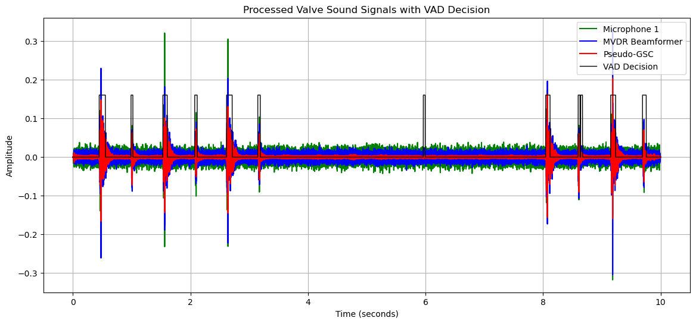

$$\small{\textbf{Digital Signal Processing, Deep Learning, and Machine Learning for Unsupervised Anomaly Detection}} $$   
$$\small{\textbf{Malfunctioning Industrial Machine Investigation and Inspection (MIMII)}}$$
$$\small{\textbf{Dr. Stéphane DEDIEU,  Summer 2024 - rev. June 2025 }}$$


<h1 align="center">MIMII Dataset: Unsupervised Classification of Valve Sounds with CNN-Based Autoencoder</h1>

This repository hosts an unsupervised classification pipeline for detecting valve anomalies in industrial machinery, addressing costly failures through acoustic monitoring with the MIMII dataset (valves, -6 dB, 0 dB, 6 dB SNR; CC BY-SA 4.0, Hitachi, Ltd., https://zenodo.org/records/3384388). Unlike traditional MIMII approaches that classify noisy signals directly, we denoise multi-channel audio from an 8-microphone TAMAGO-03 array (16 kHz, 16-bit) using MVDR beamforming and a custom static Generalized Sidelobe Canceler (GSC) with Ephraim-Malah gain, transforming the array into a noise-robust “smart sensor.” Our proprietary AC-STFT transform achieves an ROC AUC of 0.99 on the +6dB valve dataset, powering a CNN-based autoencoder for robust anomaly detection (e.g., contamination, leakage). Targeting applications like predictive maintenance for HVAC systems (e.g., TRANE compressors), the pipeline includes frame alignment for consistent performance in noisy factories. Developed by [bloo audio], ongoing results are showcased on  ([LinkedIn](https://www.linkedin.com/in/sdedieu/)). Explore code, notebooks, and visualizations below.

<br> 

### Potential Applications
This pipeline, leveraging Python, TensorFlow, Deep Learning, AC-STFT, and IoT, supports real-time anomaly detection in dynamic signals from sensors (microphones, accelerometers, piezosensors, electromagnetic sensors, multisensor arrays). Applications include:

- **Rotating Machinery Failure Detection**: Bearings, motors, rotors.
- **HVAC Fault Detection and Diagnosis (FDD)**: Pumps, compressors, valves.
- **Additional Use Cases**: Wind turbine monitoring, structural health monitoring (bridges, buildings), automotive engine diagnostics, railway track/train monitoring, medical device monitoring, and multisensor systems for noise, vibration, and electromagnetic field reduction in industrial IoT deployments.

<b>Keywords:</b> Python, TensorFlow, Deep Learning, ACSTFT, IoT

## Project Overview
We aim to automatically detect valve failures (e.g., contamination, leakage) in the MIMII dataset using unsupervised learning, focusing on acoustic signals recorded with an 8-microphone TAMAGO-03 array (16 kHz, 16-bit). Unlike traditional approaches, we denoise multi-channel signals before classification, transforming the array into a "smart sensor" for industrial monitoring. The pipeline is divided into three parts:

- **Part I: Autoencoder Classification** – Train a CNN-based autoencoder on normal valve sounds (6 dB SNR) to flag anomalies via reconstruction errors.
- **Part II: Noise Reduction** – Develop 8-mic beamforming and Ephraim-Malah filtering to isolate valve sounds in noisy factories.
- **Part III: Comparative Analysis** – Compare autoencoder performance on raw vs. denoised –6 dB valve data, using aligned 1.5s frames.

### Key Features

- **AC-STFT Features**: Proprietary complex transform (256x256x2 spectrograms magnitude+phase, hop_length=91, n_fft=512) detects anomalies, outperforming STFT by ~25% (AUC: 0.992–0.998 vs. 0.7416 for id_04).
- **CNN Autoencoder**: Unsupervised model (latent_dim=128, dropout=0.5, L2=0.002) trained on normal frames, achieving AUC > 0.9 (ongoing, June 3, 2025).
- **Frame Alignment**: Identical 1.5s frames extracted across 6 dB and –6 dB (raw/denoised) datasets using saved indices for consistency.
- **Scalability**: Pipeline adapts to other machines (compressor, sliders...) for predictive maintenance.
- **8-Mic Denoising**: Beamforming (e.g., MVDR) and spectral subtraction suppress factory noise, enhancing valve signals (–6 dB SNR dataset).

### Data Acquisition and datasets

The MIMII dataset (CC BY-SA 4.0, Hitachi, Ltd., https://zenodo.org/records/3384388) provides audio recordings from an 8-microphone circular array capturing valve sounds in real factory environments. Recordings include normal and faulty valve conditions under three signal-to-noise ratios (SNRs): -6 dB, 0 dB, and 6 dB. Background noise was recorded separately and added to the valve sounds to simulate noisy industrial settings. Audio clips (16 kHz, 1-3 seconds) are stored in `data/VAD_valves/` for +6 dB and `data/VAD_noise/` for -6 dB datasets, used for training and evaluating the CNN-Autoencoder and denoising pipeline. Recording environment and setup are detailed in Appendix A, and the microphone array is described in Appendix B.

- **MIMII Dataset**: Valve sounds (id_00, id_02, id_04, id_06) at 6 dB, 0 dB, –6 dB SNR, recorded with 8-mic TAMAGO-03 array. Normal (~5000–10000s) and anomalous (~1000s) sounds per valve. [Zenodo: 10.5281/zenodo.3384388][](https://zenodo.org/records/3384388)
- **6_dB_valve**:
10 seconds recordings (WAV files), fs= 16 kHz, SNR=6dB. We extract 1.5s frames from the 10s recordings and focus on the valves impulse sounds.    
  - Normal: 3691 1.5s frames (id_00: 991, id_02: 708, id_04: 1000, id_06: 992).
  - Abnormal: 479 frames (id_00: 119, others: 120).
  - Source: 10s WAVs split via Hilbert envelope filtering (threshold_factor=1.5).
- **–6_dB_valve**: Noisy data, to be denoised and aligned with 6_dB_valve frames (planned, in Part III, Summer 2025).
- **Preprocessing**: AC-STFT spectrograms (256x256x2, magnitude + phase, scaled [0, 1]) from 1.5s frames.


## Pipeline Details

### Part I: CNN-Based Autoencoder
- **Objective**: Train an autoencoder on normal 6_dB_valve frames to detect anomalies (high reconstruction errors).
- **Feature Extraction:  AC_STFT**
 
 We developed a novel custom complex transform, AC-STFT, applied to 1.5s audio frames. This transform captures time-frequency relationships, revealing distinct patterns and dependencies in valve sound data. Notably, the phase component exhibits increased complexity in damaged valves, distinguishing them from normal ones. This enhances CNN autoencoder performance for anomaly detection, whether trained on a single valve type (e.g., `id_04`) or a unified model across multiple types (`id_00, id_02, id_04, id_06`).  
Below is a comparison of normal and abnormal valve sounds using AC-STFT on a 1.5s frame, showing magnitude and phase (X, Y units in samples).
Uses **AC-STFT** (novel custom transform) for robust anomaly detection across valve types.
We will compare results versus c-STFT: Standard complex STFT (magnitude and unwrapped phase along time axis). 

   
| <p align="center">  </p> |   <p align="center">  </p> |   
|:---:|:---:|   
| <center> <i> STFT: Magnitude </i></center> |   <center> <i> STFT: Unwrap Phase </i> </center> |  
| <p align="center">  </p> |   <p align="center">  </p> |   
| <center> <i> AC-STFT: Magnitude  </i> </center> |   <center> <i> AC-STFT: Phase  </i></center> |  
<div align="center">Top: normal valves, bottom: abnormal valves</div>   

- **Model**:
  - Architecture: CNN (32→64→128 filters, Conv2D/Transpose, latent_dim=128).
  - Regularization: Dropout=0.5, spatial dropout=0.3, L2=0.002.
  - Optimizer: Adam with ReduceLROnPlateau (factor=0.5, patience=3, min_lr=1e-6).
  - Loss: MSE, batch_size=64, epochs=30, early stopping (patience=10).
 

    
| <p align="center">  </p> |   
|:---:|   
| <center><i> CNN-Autoencoder architecture </i> </center> |  
 
  

- **Training**:
  - Data: `ids_X_train` (3691 normal, 256x256x2), balanced `ids_X_test` (958: 479 normal + 479 abnormal, seed=25) for the "unified model" (`id_00, id_02, id_04, id_06`).  (240: 120 normal + 120 abnormal, seed=25) for the single valve (e.g., `id_04`) model.
  - Initial Run (Stopped, Epoch 10): Overfitting (loss=0.0467, val_loss=0.0848, gap=0.0381, spike to 0.1111).
  - Retraining (June 3, 2025, Ongoing): Improved at Epoch 8 (loss=0.0500, val_loss=0.0529, gap=0.0029, lr=0.0010).
  - Target: val_loss ~0.0500, gap < 0.006, AUC > 0.9 (vs. id_04’s 0.992–0.998).

 - **Single Valve Model Performance  AC-STFT**: The CNN autoencoder, trained on +6dB valve sounds (`id_04`) using the novel **AC-STFT** achieves:
   - **ROC AUC**: 1.000
   - **Accuracy**: 0.992
   - **Precision**: 0.992
   - **Recall**: 0.992
   - **F1-score**: 0.992
   - **Confusion Matrix**: [[119 1], [1 119]] (True Negatives: 119, True Positives: 119)

| <p align="center">  </p> |   <p align="center">  </p> |   
|:---:|:---:|   
| <center> <i> Training History</i> </center> |   <center><i> ROC-AUC  </i> </center> |  
| <p align="center">  </p> |   <p align="center">  </p> |   
| <center> <i> Confusion Matrix </i> </center> |   <center> <i> Reconstruction error (MSE) </i> </center> |  

<br>
<br>


- **Unified Model Performance**: The CNN autoencoder, trained on +6dB valve sounds (`id_00, id_02, id_04, id_06`) using the novel **AC-STFT** achieves:
  - **ROC AUC**: 0.958
  - **Accuracy**: 0.900
  - **Precision**: 0.862
  - **Recall**: 0.952
  - **F1-score**: 0.905
  - **Confusion Matrix**: [[406 73]; [23 456]] (True Negatives: 406, True Positives: 456)
  - **Training History**: Loss and validation loss over 40 epochs, showing convergence (plots saved at `C:\Users\drste\Project_IA\Notebooks\path\to\your\results`).
    
| <p align="center">  </p> |   <p align="center">  </p> |   
|:---:|:---:|  
| <center> <b><i> Training History</i></b> </center> |   <center> <b><i> ROC-AUC  </i></b> </center> |  
| <p align="center">  </p> |   <p align="center">  </p> |   
| <center> <i> Confusion Matrix </i> </center> |   <center> <i> Reconstruction error (MSE) </i> </center> |  
 
<br>
<br>


## Part II: Noise Reduction
- **Objective**: Denoise –6 dB valve audio to create `denoised_id##` dataset, enhancing valve signals for anomaly detection.
- **Methods**:
  - **Beamforming**: MVDR or delay-and-sum using 8-mic TAMAGO-03 array, modeled as a prolate spheroid for diffraction (Part II simulation planned).
  - **Ephraim-Malah Filtering**: Spectral subtraction to remove residual noise.
  - **VAD**: Excludes artifacts.
- **Status**: Denoising pipeline in development, to be applied to –6 dB 10s WAVs before 1.5s frame extraction (IA laptop, June 3, 2025).
- **Output**: Denoised WAVs in `-6_dB_valve/denoised`, aligned with 6_dB_valve frames.


####  Microphone Array

R=0.068/2 % Radius of the circular array in meter (m)
% Circular array geometry

    RP(1,:)= [R 0 0.00]
    RP(2,:)= [Rcos(45pi/180) Rsin(45pi/180) 0.00]
    RP(3,:)= [Rcos(90pi/180) Rsin(90pi/180) 0.00]
    RP(4,:)= [Rcos(135pi/180) Rsin(135pi/180) 0.00]
    RP(5,:)= [R*cos(pi) 0 0.00]
    RP(6,:)= [Rcos(225pi/180) Rsin(225pi/180) 0.00]
    RP(7,:)= [Rcos(270pi/180) Rsin(270pi/180) 0.00]
    RP(8,:)= [Rcos(315pi/180) Rsin(315pi/180) 0.00]

|<p align="center">  </p> |  <p align="center">  </p> |
|:---:|:---:|  
| <center> <i> Optimum filters 000 deg </i> </center> | <center> <i> Directivity Index </i> </center> |       
    
####  MVDR beamforming
    
| <p align="center">  </p> |  
|:---:|
| <center> <i> Directivity v. Frequency - Horizontal plane. </i> </center> |     
    

The main beam is steered at 000 degrees. In the valve direction. <br>

    
|<p align="center">  </p> |  <p align="center">  </p> |   <p align="center">  </p>        |
|:---:|:---:|:---:|  
| <center> <i> Beampattern 500Hz  </i> </center> | <center> <i> Beampattern 1000Hz </i> </center> |   <center><i> Beampattern 5000Hz </i> </center>       |
    
   
####  pseudo-GSC implementation

    
| <p align="center">  </p> |  
|:---:|  
| <center> <i> GSC Block-Diagram from [6] </i> </center> |       
   


####  Valve Activity Detection

Just like in speech enhancement algorithms, for optimal performance, the second stage of the denoising process must cease collecting noise frames when the valve is active. Therefore, we design a VAD, not for Voice Activity Detection, but for "Valve Activity Detection".<br>
Ideally, we should have access to valve sounds without any noise. We built labeled datasets of background noise and valve sounds consisting of 512-point mono sound frames, each lasting 32 ms, sampled at 16 kHz (512 samples). 
 
- Valve sound frames: collected from the 6 dB SNR dataset, specifically Normal, id00, id02, id04, id06. Ideally, we would have access to valve sounds against a silent background, but such data is not available. We had access only to "noisy" valve sound frames, which is why we selected the best SNR data available.
- Background noise frames: collected from the -6 dB SNR dataset, Normal, id00, id02, id04, id06, when valves are inactive.

We explored Low-complexity VAD models based on FFT and Machine Learning. These models will be utilized in our two-stage Noise Reduction algorithm.

Future work if necessary: High-complexity models leveraging advanced features:  Short-Time Fourier Transforms (STFT), mel-spectrograms, or wavelet transforms and Deep Learning, specifically a Convolutional Neural Network (CNN).

The low-complexity models are the priority for proceeding with Noise Reduction. 


####  Preliminary Results

Application of MVDR and Ephraim-Malah gain, with an without VAD (Valve Activity Detection).  
Input 10s recording:  name_audio='id06_n_00000048'  in '-6dB valve dataset'. 
    
    
 |<p align="center">  </p> |  
|:---:|
 | <center> <i> MVDR+EM noise reduction.  </i> </center> |      
 |   <p align="center">  </p> |
| <center> <i> MVDR+EM noise reduction. With VAD. </i> </center> |     
    
        
    


<br>
<br>


## Part III: Comparative Analysis  (under construction - August 2025)
- **Objective**: Compare autoencoder performance on raw vs. denoised –6 dB valve data, using aligned 1.5s frames.
- **Frame Alignment Strategy**:
  - Extract 1.5s frames from 6_dB_valve 10s WAVs (Hilbert envelope, hop=100 ms), saving indices (valve_id, file_name, label, frame_number, start_time) to `results/6dB_frame_indices.csv`.
  - Use indices to extract identical frames from –6 dB_valve (raw: `-6_dB_valve/valve_1p5s`, denoised: `-6_dB_valve/denoised_1p5s`).
  - Status: Planned for IA laptop, June 3, 2025.
- **Analysis**: Train/test autoencoders on raw/denoised –6 dB data, report AUCs, and compare to 6_dB_valve.

### Results

### Future Work
- **–6 dB Denoising**: Implement 8-mic pipeline (beamforming, Ephraim-Malah) for Part I, extract aligned frames for Part III.
- **Industrial Applications**: Adapt pipeline for compressor monitoring (8-mic arrays, vibration sensors).


<!-- ### Installation 
```bash
pip install -r requirements.txt
```     -->
<br>
<br>

##   References

<br>

https://github.com/MIMII-hitachi/mimii_baseline/ 

[1] Harsh Purohit, Ryo Tanabe, Kenji Ichige, Takashi Endo, Yuki Nikaido, Kaori Suefusa, and Yohei Kawaguchi, <i>“MIMII Dataset: Sound Dataset for Malfunctioning Industrial Machine Investigation and Inspection,”</i> arXiv preprint arXiv:1909.09347, 2019.

[2] Harsh Purohit, Ryo Tanabe, Kenji Ichige, Takashi Endo, Yuki Nikaido, Kaori Suefusa, and Yohei Kawaguchi, <i>“MIMII Dataset: Sound Dataset for Malfunctioning Industrial Machine Investigation and Inspection,” </i> in Proc. 4th Workshop on Detection and Classification of Acoustic Scenes and Events (DCASE), 2019.

[3] Y. Kawaguchi, R. Tanabe, T. Endo, K. Ichige, and K. Hamada, <i>“Anomaly detection based on an ensemble of dereverberation and anomalous sound extraction,”</i> in Proceedings of the IEEE International Conference on Acoustics, Speech and Signal Processing (ICASSP), 2019, pp. 865–869

[5] M. Brandstein and D. Ward, “Microphone Arrays: Signal Processing Techniques and Applications,” Digital Signal Processing, 2001, Springer. 

[6] Nilesh Madhu and Rainer Martin, <i>"A Versatile Framework for Speaker Separation Using a Model-Based Speaker Localization Approach" </i>, October 2011 IEEE Transactions on Audio Speech and Language Processing 19(7):1900 - 1912, DOI:10.1109/TASL.2010.2102754


<br>
<br>

## APPENDIX


### A. Dataset: Recording environment and Set-up 
    
<br>
<span style="color:#4169E1">  
    
We quote the reference article [1] in green: 
    
Regarding the dataset:  <br> 
 
<span style="color:#029942">  

<i> "In this paper, we present a new dataset of industrial machine sounds that we call a sound dataset for malfunctioning industrial machine investigation and inspection (MIMII dataset). Normal sounds were recorded for different types of industrial machines (i.e., valves, pumps, fans, and slide rails), and to resemble a real-life scenario, various anomalous sounds were recorded (e.g., contamination, leakage, rotating unbalance, and rail damage). The purpose of releasing the MIMII dataset is to assist the machine-learning and signal processing community with their development of automated facility maintenance." </i>
<br>
<span style="color:#4169E1">  
Regarding the 8-microphones recordings:
<span style="color:#029942">  
<i> "The dataset was collected using a TAMAGO-03 microphone manufactured by System In Frontier Inc. [21]. It is a circular micro-
phone array that consists of eight distinct microphones, the details of which are shown in Fig. 1. By using this microphone array, we can evaluate not only single-channel-based approaches but also multi-channel-based ones. The microphone array was kept at a distance of 50 cm from the machine (10 cm in the case of valves), and 10-second sound segments were recorded. The dataset contains eight separate channels for each segment. Figure 2 depicts the recording setup with the direction and distance for each kind of machine. Note that each machine sound was recorded in a separate session. Under the running condition, the sound of the machine was recorded as 16-bit audio signals sampled at 16 kHz in a reverberant environment. Apart from the target machine sound, background noise in multiple real factories was continuously recorded and later mixed with the target machine sound for simulating real environments. For recording the background noise, we used the same microphone array as for the target machine sound."</i>
<br>
<span style="color:#4169E1">  
All datasets for normal and "abnormal" machines: pumps, valves, sliders, fans can be downloaded here:
    
https://zenodo.org/records/3384388  
    
<span style="color:#4169E1">  
Part of this dataset: Single channel microphone only, plus Toy car, Toy conveyor, was used in the DCASE 2020 Challenges in 2020 and in the following years.  
    
https://dcase.community/challenge2020/task-unsupervised-detection-of-anomalous-sounds <br>
https://dcase.community/challenge2022/task-unsupervised-anomalous-sound-detection-for-machine-condition-monitoring    
    
### B. Microphone Array     
    
The MIMII dataset was recorded with the following 8-microphones array:  <br> 

| <p align="center">  </p> |  <p align="center">  </p> |   
| ---       |   ---  |   
| <center> <b><i> The circular microphone array <br> from [1] </i></b> </center> |   <center> <b><i> The Tamago concept <br> from https://www.sifi.co.jp/en/product/microphone-array/ </i></b> </center> |     
    
The microphone array is embedded in a hard "egg shape" in a vertical position. For optimizing the beamformer, we should account for the diffraction of acoustic waves on the egg shape. This requires either:
- an approximation of the egg shape by a prolate spheroid providing an analytical solution of the ascoutic field 
- or a Boundary Element Model 
    
We may work on an analytical model, the prolate spheroid, but it will take some time. <span style="color:#900C3F">  At the moment we will treat the 8-microphone array in free field. It is an approximation, and the MVDR beamformer will perform properly at low frequency when the acoustic wavelength is very large compared with the size of the egg, but it will poorly perform in the medium and high frequency range up to 8kHz.  </span>
   
    
The configuration for recording the various machines is presented below.  
    
| <p align="center">  </p> |  
| ---       |   
| <center> <b><i> Recording configuration with the circular microphone array <br> from [1] </i></b> </center> |     

We will work with the Valve dataset only, therefore with a beamformer steered at 000 deg.  
    
https://www.sifi.co.jp/en/product/microphone-array/
    

###  C. Denoising strategy

<br>

<span style="color:#4169E1">  
    
In various models and results developed during the DCASE2020 and DCASE2022 challenges, which included single channels from the MIMII dataset, noise and reverberation were often identified as significant factors contributing to poor classification accuracy.

When designing a system for capturing industrial sounds, a microphone array would be an optimal choice to:

- Attenuate reverberations.
- Attenuate ambient noise.

Additionally, it offers the capability to focus a beam towards the sound source of interest.

Can a beamformer eliminate ambient noise artificially added to the sound of interest?

Background noise that was added to the sound sources of interest in the MIMII dataset was captured using the same TAMAGO 8-microphone array, and subsequently, all channels were mixed under the following conditions:

- SNR = 6 dB
- SNR = 0 dB
- SNR = -6 dB (representing the worst-case scenario)

We plan to denoise and classify signals under the SNR = -6 dB condition, which is the most challenging scenario.

- Assuming microphone 1 is directed towards the sound source of interest (in this case, a valve), and if background noise was also recorded from that direction, it would be difficult to denoise the recordings effectively.
- However, if the ambient noise recorded by the array is isotropic, the beamformer would be more efficient in this scenario.

Fortunately, in most recordings we reviewed from the -6dB_Valve dataset, the ambient noise appears to be relatively isotropic, or at least, the primary noise source is not directly at 0 degrees. Consequently, the MVDR beamformer should effectively attenuate the ambient noise, particularly at frequencies below 1000-1500 Hz, assuming the array operates in a free field.

####  Multi-Microphone diagnosis sensor.

<br>
<span style="color:#4169E1">  
  
If we were to design a sensor for monitoring industrial machinery sounds in a noisy environment, then a multi-microphone sensor, i.e., a microphone array, would make absolute sense.

Here, we are going to transform the TAMAGO microphone array into a diagnostic sensor, employing proper beamforming filters and a noise reduction strategy.

#### Beamforming

Beamforming is a noise reduction technique based on spatial filtering. Essentially, multiple microphones capture acoustic waves, and their outputs are combined to increase the gain in a specific direction. Beamforming can be combined with classic noise reduction techniques, as we will see in the next section.

The 68 mm diameter microphone array, though small, with its eight microphones, represents an overkill, leading to oversampling of acoustic waves at low frequencies, which creates the following issues:

- With too many microphones, optimal MVDR beamforming filters can achieve very high gains for maximum directivity, typically +50 or +60 dB. This significantly degrades the White Noise Gain (WNG), making their practical implementation problematic.
- Minor mismatches in magnitude and phase among the microphones can further degrade the beamformer's performance significantly.


Therefore, when implementing the MVDR beamforming with the TAMAGO microphone array, we will introduce substantial regularization at low frequencies, which will compromise the Directivity Index at these frequencies.

#### Computing Optimal MVDR Beamforming Filters

The 8-microphone array is embedded within a rigid egg shape. It cannot be treated as a free-field array, except at low frequencies where the acoustic wavelength is very large compared to the size of the egg. We will assume that the TAMAGO egg is a hard prolate spheroid and will use analytical or semi-analytical models to characterize the acoustic field diffracted by the "egg". This will be explored in PART II. Once the simulation is complete, we will develop a new MIMII denoised valve dataset.

We compute two sets of filters:

- Main beam: optimal MVDR beamforming filters for the main beam and channel, assuming an isotropic noise field. These are filters $W^H_f$ in the block diagram in the next section.
- "Noise channel": filters for a non-adaptive generalized sidelobe canceller (GSC) or multi-channel Wiener for the secondary, "orthogonal" channel. These are filters  $W^H_{v}B$ in the block diagram.

The code for generating these two sets of filters is confidential. <br> Theoretical aspects for computing the filters are presented in Ward [5], Chapter II: "Superdirective Microphone Arrays". <br> The computation of the filters is left as an exercise. Some experimentation will be necessary for regularizing the various ill-conditioned matrices.


<i>R=0.068/2</i>  % Radius of the circular array in meter (m) <br>
% Circular array geometry <br>
- <i> RP(1,:)= [R                   0                        0.00]
- RP(2,:)= [R*cos(45*pi/180)    R*sin(45*pi/180)         0.00]
- RP(3,:)= [R*cos(90*pi/180)    R*sin(90*pi/180)         0.00]
- RP(4,:)= [R*cos(135*pi/180)   R*sin(135*pi/180)        0.00]
- RP(5,:)= [R*cos(pi)           0                        0.00]
- RP(6,:)= [R*cos(225*pi/180)   R*sin(225*pi/180)        0.00]
- RP(7,:)= [R*cos(270*pi/180)   R*sin(270*pi/180)        0.00]
- RP(8,:)= [R*cos(315*pi/180)   R*sin(315*pi/180)        0.00]</i>

    
|<p align="center">  </p> |  <p align="center">  </p> |
|       ---       |         ---       | 
| <center> <b><i> Optimum filters 000 deg </i></b> </center> | <center> <b><i> Directivity Index </i></b> </center> |       

Beamforming Filters in the frequency domain: real_part and imaginary part are stored in the following files: 

Filters:  512 points, Fs= 16000 Hz, double-sided ! 
Frequencies=[0 : Fs/NFFT : Fs-Fs/NFFT]
    
####  Beampatterns

We can plot the beampatterns in the horizontal plane v. frequency : 
    
| <p align="center">  </p> |  
|       ---       |       
| <center> <b><i> Directivity v. Frequency - Horizontal plane. </i></b> </center> |     
    

The main beam is steered at 000 degrees. In the valve direction. <br>

    
    
|<p align="center">  </p> |  <p align="center">  </p> |   <p align="center">  </p>                       |
|       ---       |         ---       |  ---  |
| <center> <b><i> Beampattern_500Hz  </i></b> </center> | <center> <b><i> Beampattern_1000Hz </i></b> </center> |   <center> <b><i> Beampattern_4500Hz </i></b> </center> |

<br>

#### Generalized Side Lobe Canceller 

We will use a fixed beamforming approach. The fixed GSC strategy is equivalent to a multi-channel Wiener gain. But instead of implementing a spectral difference, we can replace it with more advanced NR gains and evaluation of a priori_SNR. 

Denoising is performed in two stages:

- stage I: MVDR beamforming alone 
- stage II: Generalized Sidelobe Canceller with 2 channels 

The structure of a real GSC is presented in the following article: <br>
https://www.researchgate.net/figure/General-structure-of-the-generalized-sidelobe-canceller-GSC-with-Y-k-b-being-the_fig2_224208512

We extract the block diagram. 
    
| <p align="center">  </p> |  
| ---       |   
| <center> <b><i> GSC Block-Diagram from [6] </i></b> </center> |       
    

We propose a pseudo-real-time implementation. A "valve activity detector" would be necessary when performing spectral subtraction; the algorithm must stop collecting noise frames when the valve is active!

Initially, we will approximate without a "valve activity detector" because much of the background noise is somewhat pseudo-stationary, while the valve sound is brief. We will accumulate a long "noise history." This approach might not be effective for other devices like pumps or fans. Subsequently, we will develop a Valve Activity Detector and compare both methods: with and without VAD.

The GSC might introduce distortion into the valve sound. We will assess whether this affects the accuracy of the classification model. Such added distortion could be a significant issue for applications like Automatic Speech Recognition (ASR).

#### Pseudo-Real-Time Implementation:

Frame-by-Frame Processing: We implement this with overlap-add, sliding an NFFT-length window over all 10-second signals with a 66% overlap. We compute the FFT, apply beamforming, and noise reduction gain in the frequency domain, then reconstruct the denoised output signals frame by frame using an IFFT.

Parameters for Denoising the Recordings:

- Frames: NFFT = 512, sampling rate (fs) = 16000 Hz, frame duration (t) = 32 ms.
- Slide an NFFT=512 point window frame over the 10-second recordings with a shift of NFFT/3.
- Compute the FFT for each microphone channel.
- Apply the beamforming filters in the frequency domain to each microphone channel.
- Sum the results.
- Compute the IFFT.
- Reconstruct the denoised signal frame by frame.

<!-- This procedure is detailed in the Jupyter Notebook: Part I: Preliminary Activities. -->

###  Early Results Beamforming

We selected an 8-channel recording for processing: id00_n_00000117.

<b>Processing Applied:</b>

- MVDR beamforming was implemented, assuming the microphone array operates in a free field.
- Subsequently, a Generalized Sidelobe Canceller (GSC) strategy was employed, incorporating Valve Activity Detection.


<b>Conversion for GitHub Playback:</b>

The original .wav files were converted to .mp4 format using VLC media player for easier playback on GitHub.


<b>Observation from Processed Recordings:</b>

- MVDR Beamforming: This method showcases effective background noise attenuation at lower frequencies. However, there's a noticeable degradation in noise reduction at higher frequencies, likely due to the free-field assumption.
- GSC Strategy: Offers additional noise reduction beyond MVDR, though it introduces some distortion in valve sounds.


Further Information:  <br>

A detailed analysis of these techniques and results will be available in a forthcoming Jupyter Notebook.


<b><i>Microphone n. 1:</i></b>

https://github.com/user-attachments/assets/843f1dee-9837-4e55-85d5-2264ed983476

<b><i>MVDR Beamformer output:</i></b>

https://github.com/user-attachments/assets/ecfa8963-bb75-4864-99d7-4e31257d3b4a

<b><i>GSC output with Valve Activity Detection: </i></b> 

https://github.com/user-attachments/assets/c4e86685-4dbe-4a32-aa33-dfcb5771128d


